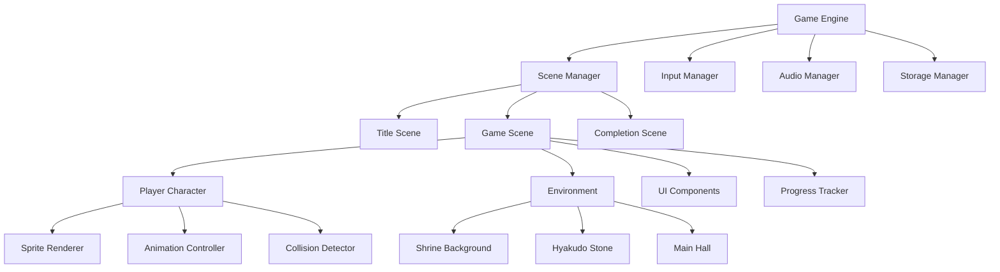

# Design Document

## Overview

御百度参りwebゲームは、HTML5 CanvasとJavaScriptを使用した2Dドット絵スタイルのブラウザゲームです。プレイヤーはキャラクターを操作して百度石と社殿の間を100往復し、完了時に神様との特別な出会いを体験します。

### 技術スタック
- **フロントエンド**: HTML5, CSS3, JavaScript (ES6+)
- **グラフィックス**: HTML5 Canvas API
- **音響**: Web Audio API
- **データ保存**: localStorage
- **アニメーション**: requestAnimationFrame

### アーキテクチャパターン
- **MVC (Model-View-Controller)** パターンを採用
- **Component-based** 設計でゲームオブジェクトを管理
- **State Machine** パターンでゲーム状態を制御

## Architecture



### 主要コンポーネント

1. **Game Engine**: ゲームループとコア機能を管理
2. **Scene Manager**: 画面遷移とシーン管理
3. **Player Character**: プレイヤーキャラクターの制御
4. **Environment**: 神社境内の環境オブジェクト
5. **Progress Tracker**: 往復回数と進捗の管理
6. **Audio Manager**: 効果音とBGMの制御
7. **Storage Manager**: ゲームデータの保存・復元

## Components and Interfaces

### Core Game Engine

```javascript
class GameEngine {
  constructor(canvasId)
  init()
  start()
  stop()
  update(deltaTime)
  render()
}
```

### Scene Management

```javascript
class SceneManager {
  constructor(gameEngine)
  addScene(name, scene)
  switchScene(name)
  getCurrentScene()
  update(deltaTime)
  render(context)
}

class Scene {
  constructor(name)
  init()
  update(deltaTime)
  render(context)
  handleInput(input)
}
```

### Player Character

```javascript
class PlayerCharacter {
  constructor(x, y)
  update(deltaTime)
  render(context)
  move(direction)
  setPosition(x, y)
  getPosition()
  checkCollision(object)
}

class SpriteRenderer {
  constructor(spriteSheet)
  render(context, x, y, frame)
  setAnimation(animationName)
}
```

### Environment Objects

```javascript
class EnvironmentObject {
  constructor(x, y, width, height)
  update(deltaTime)
  render(context)
  checkCollision(player)
}

class HyakudoStone extends EnvironmentObject {
  onPlayerReach(player)
}

class MainHall extends EnvironmentObject {
  onPlayerReach(player)
}
```

### Progress Management

```javascript
class ProgressTracker {
  constructor()
  incrementRoundTrip()
  getCurrentCount()
  getRemainingCount()
  isCompleted()
  reset()
}
```

## Data Models

### Game State

```javascript
const GameState = {
  playerName: String,
  wish: String,
  currentRoundTrips: Number,
  totalRoundTrips: Number,
  isCompleted: Boolean,
  startTime: Date,
  completionTime: Date,
  playerPosition: {x: Number, y: Number},
  currentDirection: String,
  gamePhase: String // 'input', 'playing', 'completed'
}
```

### Player Data

```javascript
const PlayerData = {
  name: String,
  wish: String,
  history: [
    {
      completionDate: Date,
      wish: String,
      duration: Number
    }
  ]
}
```

### Sprite Data

```javascript
const SpriteData = {
  character: {
    idle: {frames: Array, duration: Number},
    walking: {frames: Array, duration: Number}
  },
  environment: {
    shrine: {image: String, width: Number, height: Number},
    stone: {image: String, width: Number, height: Number}
  },
  deity: {
    appearance: {frames: Array, duration: Number},
    blessing: {frames: Array, duration: Number}
  }
}
```

## Error Handling

### Input Validation

```javascript
class InputValidator {
  static validatePlayerName(name) {
    if (!name || name.trim().length === 0) {
      return {valid: false, message: "名前を入力してください"}
    }
    if (name.length > 20) {
      return {valid: false, message: "名前は20文字以内で入力してください"}
    }
    return {valid: true}
  }
  
  static validateWish(wish) {
    if (!wish || wish.trim().length === 0) {
      return {valid: false, message: "願い事を入力してください"}
    }
    if (wish.length > 100) {
      return {valid: false, message: "願い事は100文字以内で入力してください"}
    }
    return {valid: true}
  }
}
```

### Game Error Handling

```javascript
class ErrorHandler {
  static handleCanvasError(error) {
    console.error("Canvas error:", error)
    // フォールバック表示
  }
  
  static handleAudioError(error) {
    console.warn("Audio error:", error)
    // 音声なしで継続
  }
  
  static handleStorageError(error) {
    console.warn("Storage error:", error)
    // メモリ内データで継続
  }
}
```

### Resource Loading

```javascript
class ResourceLoader {
  static async loadSprites() {
    try {
      // スプライト画像の読み込み
    } catch (error) {
      ErrorHandler.handleResourceError(error)
      // デフォルトスプライトを使用
    }
  }
  
  static async loadAudio() {
    try {
      // 音声ファイルの読み込み
    } catch (error) {
      ErrorHandler.handleAudioError(error)
      // 音声なしで継続
    }
  }
}
```

## Testing Strategy

### Unit Testing
- **Game Logic**: 往復カウント、進捗計算、完了判定のロジック
- **Input Validation**: 名前・願い事の入力検証
- **Collision Detection**: キャラクターと環境オブジェクトの当たり判定
- **Data Persistence**: localStorage への保存・復元機能

### Integration Testing
- **Scene Transitions**: シーン間の遷移とデータ受け渡し
- **Audio Integration**: 効果音とゲームイベントの連携
- **Responsive Design**: 異なる画面サイズでの表示確認

### End-to-End Testing
- **Complete Game Flow**: 名前入力から神様登場までの全体フロー
- **Data Persistence**: ブラウザ再起動後のデータ復元
- **Cross-browser Compatibility**: 主要ブラウザでの動作確認

### Performance Testing
- **Frame Rate**: 60FPSでの安定動作
- **Memory Usage**: メモリリークの検出と対策
- **Loading Time**: 初期読み込み時間の最適化

### Accessibility Testing
- **Keyboard Navigation**: キーボードのみでの操作確認
- **Touch Interface**: モバイルデバイスでのタッチ操作
- **Screen Reader**: 視覚障害者向けのアクセシビリティ

## Implementation Notes

### ドット絵アセット
- **キャラクター**: 16x16ピクセルのスプライト
- **環境**: 神社、百度石、鳥居などの背景要素
- **神様**: 特別な32x32ピクセルのスプライト
- **アニメーション**: 歩行、アイドル、神様登場の各アニメーション

### 音響設計
- **効果音**: 足音、鈴の音、神様登場音
- **BGM**: 神社の雰囲気に合った和風音楽
- **音量制御**: プレイヤーが音量を調整可能

### レスポンシブデザイン
- **デスクトップ**: 1024x768以上の解像度に対応
- **タブレット**: 768x1024の縦横両対応
- **スマートフォン**: 375x667以上の解像度に対応
- **操作方法**: キーボード（WASD/矢印キー）とタッチ操作の両対応